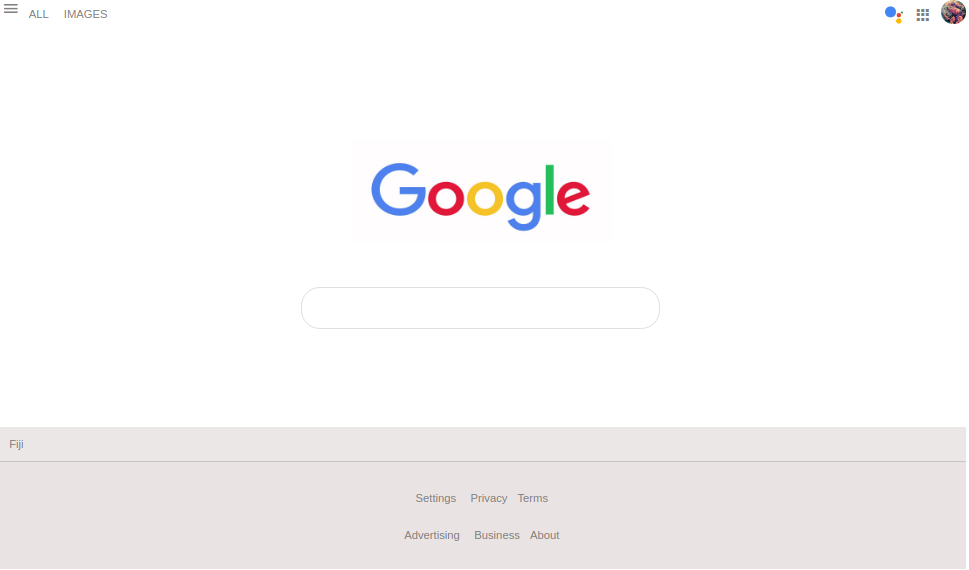

# Google homepage on android phone

## Description
This is my own project and my attempt at replicating the Google homepage as viewed on Google Chrome web browser installed in an android mobile device.

The purpose of this project is to sharpen my skills on using my current knowledge on HTML5 and CSS3 to build the front-end of the web page. However, there is no JavaScript code used for this project.

## Screenshot of the web page

## Author
Losalini Rokocakau.
**GitHub username:** *chelmerrox*